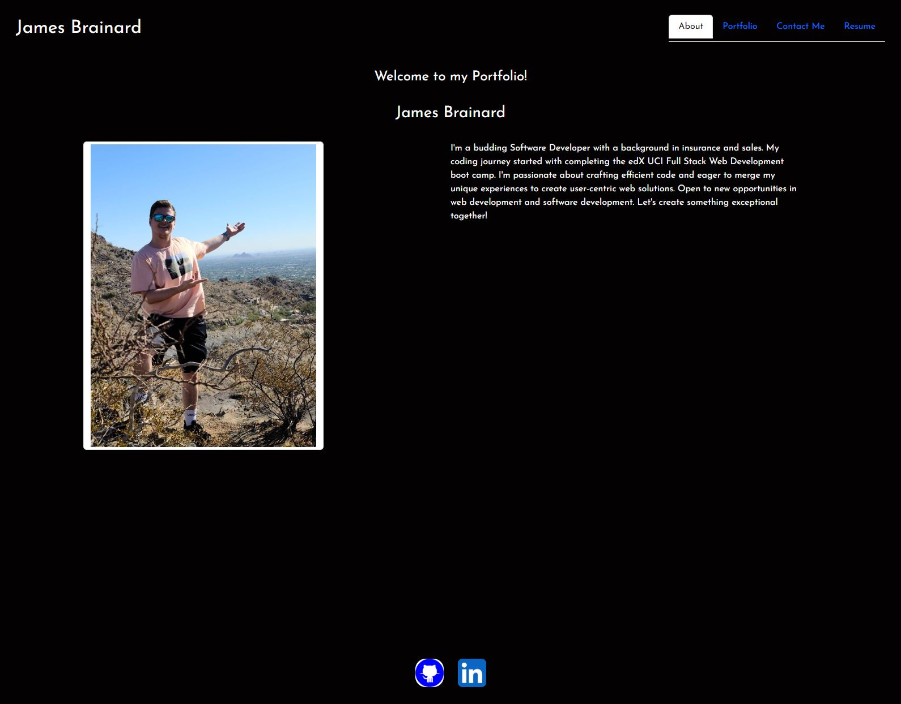

  
  # React Portfolio

  ## Description
  A professional portfolio displaying information about myself and my projects, this was built leveraging react components bootstrap and bootstrap react elements. 

  ## Table of Contents
  * [Installation](#install)
  * [Usage](#usage)
  * [Credits](#credits)
  * [License](#license)
  * [Link](#link)
  * [Questions](#question)
  
  ## Installation
  N/A

  ## Usage 
  A way to display my projects, contact information and a bit about myself. 

  ## Credits
  N/A

  ## License
  MIT

  ## Link to deployed site
  https://james-brainard.netlify.app/

  ## Screenshot of Deployed Application
  

  ## Questions
  Please refer to my github for other awesome projects! https://github.com/james-brainard

  If you have any questions regarding this application or any others. You can reach me at: james.brainard202@gmail.com